# 🧠 Axon Hire — Code Mindmap & Interaction Graph

> **Purpose:** This file helps you (or an AI assistant) instantly see which files and functions are connected, so that when you change something you know exactly what else might break.

---

## 📌 How to Use This File

1. **Changing a file?** → Find it in the graphs below → see what imports/calls it
2. **Changing a function?** → Find it in the Function Call Maps → trace what uses it
3. **Adding a feature?** → Use the Data Flow diagrams to understand the full pipeline
4. **Database change?** → Check the Schema Relationships diagram

---

## 1. 🏗 Overall Architecture

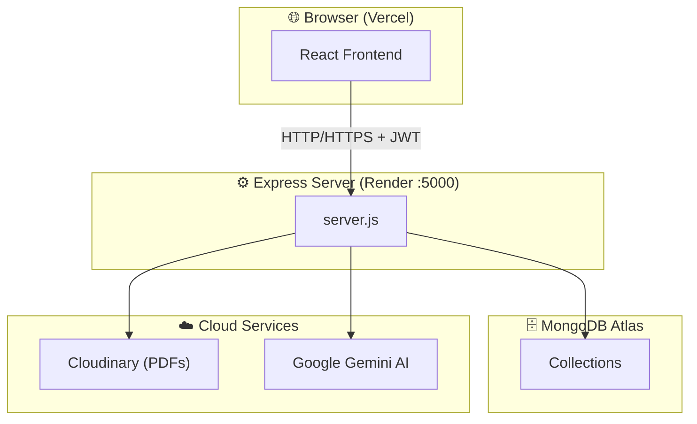

---

## 2. 📁 Backend File Dependency Graph

> Arrows mean "imports / depends on"

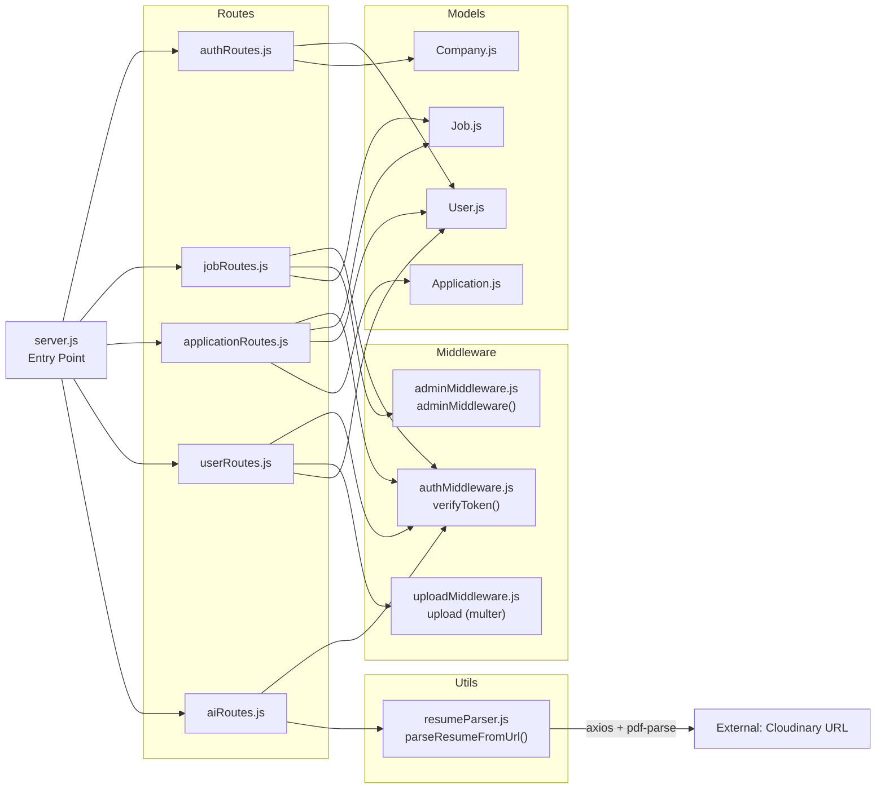

---

## 3. 📁 Frontend File Dependency Graph

> Arrows mean "imports / uses"

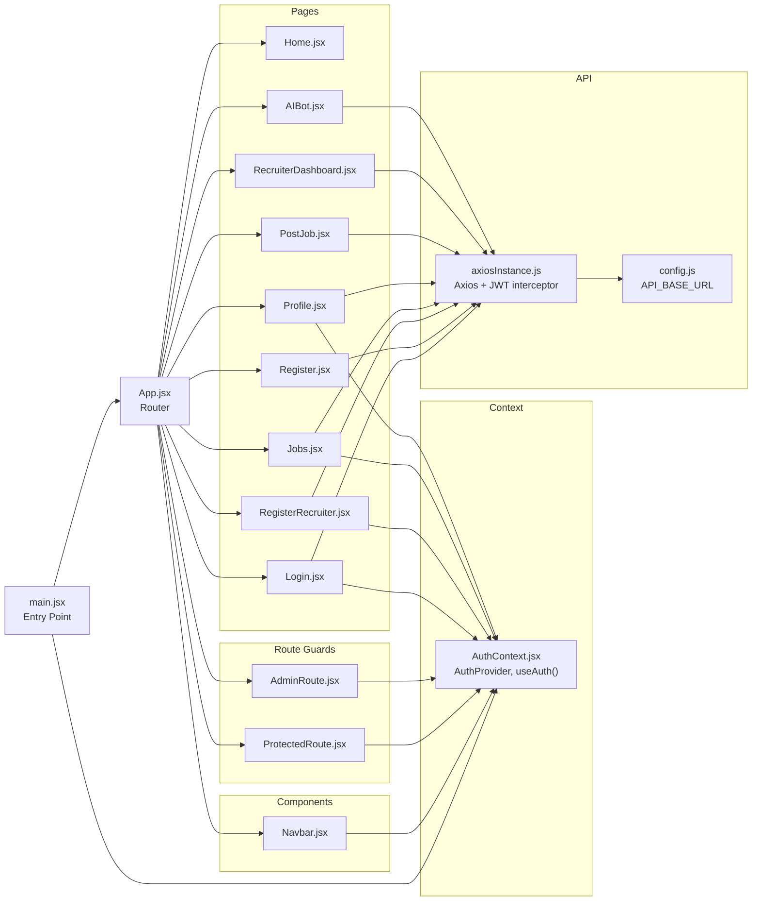

---

## 4. ⚙️ Backend Function Call Map

### 4a. Authentication Functions

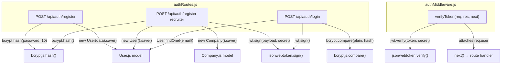

### 4b. Job Functions

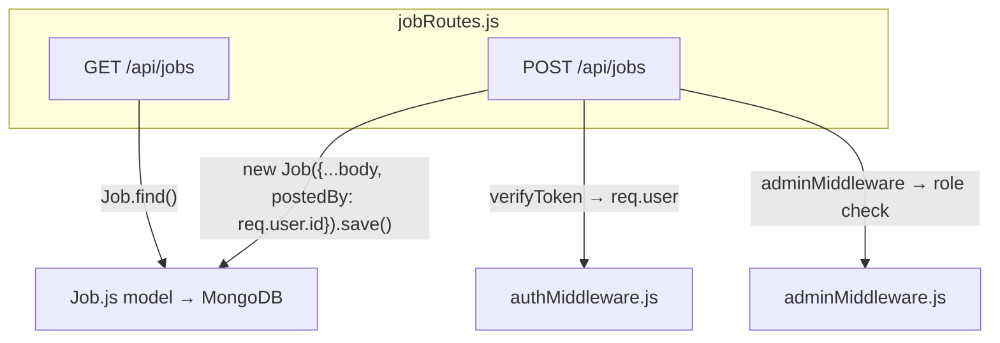

### 4c. Application Functions

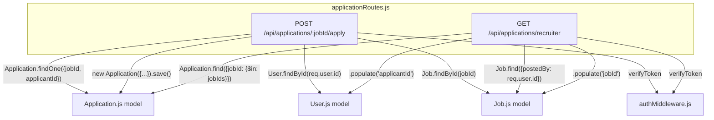

### 4d. User / Resume Functions

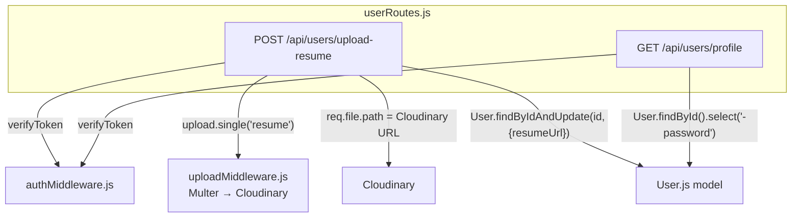

### 4e. AI Functions

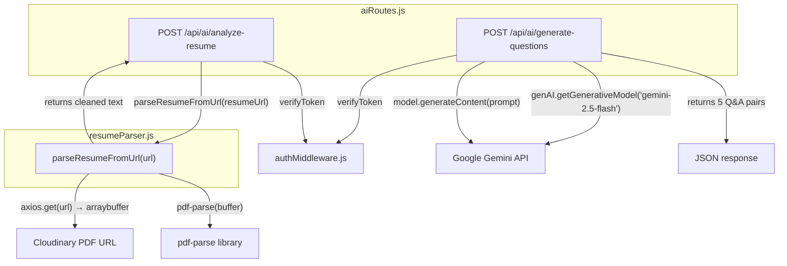

---

## 5. 🎨 Frontend Function Call Map

### 5a. Authentication & Context

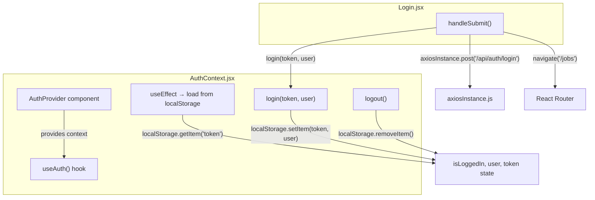

### 5b. Route Guards

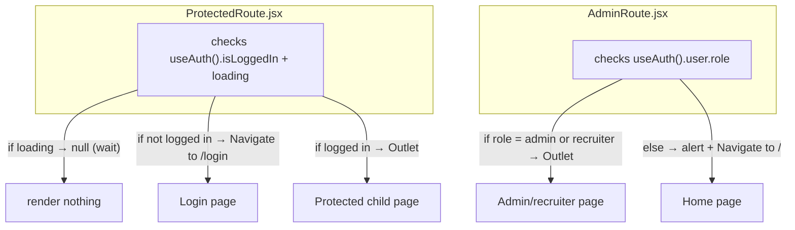

### 5c. Jobs Page

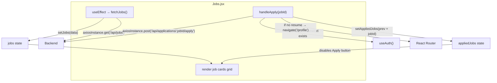

### 5d. Profile Page

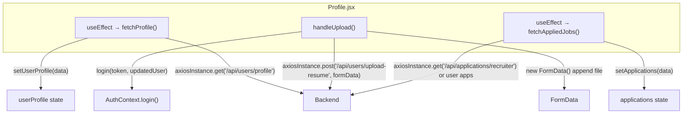

### 5e. Navbar

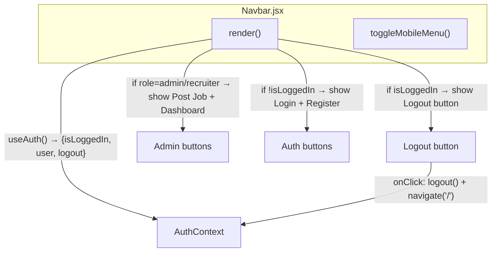

---

## 6. 🔄 Full Data Flow Diagrams

### 6a. User Registration & Login

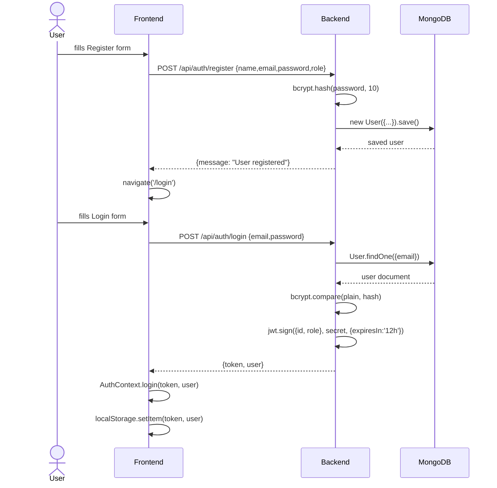

### 6b. Easy Apply Flow

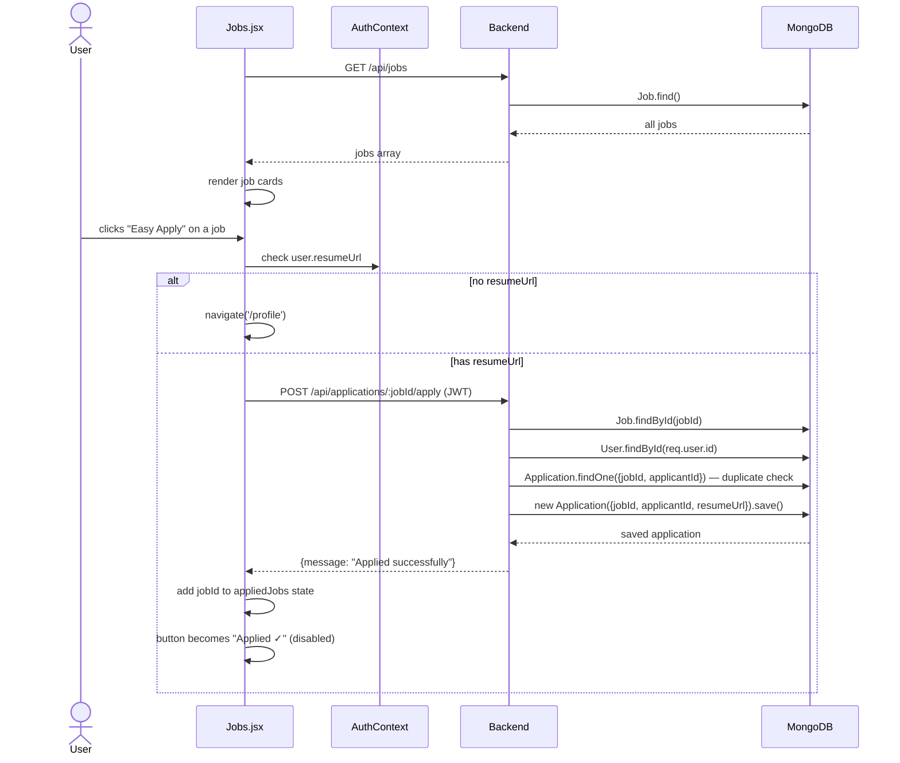

### 6c. Resume Upload Flow

```mermaid
sequenceDiagram
    actor User
    participant FE as Profile.jsx
    participant CTX as AuthContext
    participant BE as Backend
    participant CDN as Cloudinary
    participant DB as MongoDB

    User->>FE: selects PDF file + clicks Upload
    FE->>FE: new FormData(); formData.append('resume', file)
    FE->>BE: POST /api/users/upload-resume (FormData + JWT)
    BE->>BE: uploadMiddleware (Multer processes file)
    BE->>CDN: stream file to axon_resumes folder
    CDN-->>BE: {secure_url: "https://res.cloudinary.com/..."}
    BE->>DB: User.findByIdAndUpdate(id, {resumeUrl: url})
    DB-->>BE: updated user
    BE-->>FE: {message: "Resume uploaded", user: updatedUser}
    FE->>CTX: login(token, updatedUser) — refresh user state
    FE->>FE: show success message + new resumeUrl
```

### 6d. AI Interview Question Generation

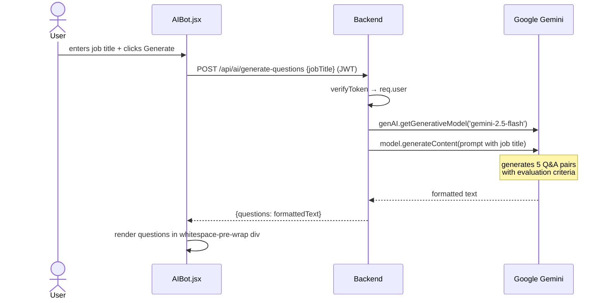

---

## 7. 🗄 Database Schema Relationships

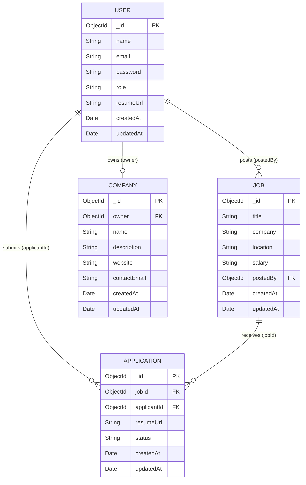

---

## 8. 🔗 File ↔ Function Quick Reference

> Use this table when you edit a function and need to find everything it affects.

### Backend

| File | Function/Export | Used By |
|------|----------------|---------|
| `authMiddleware.js` | `verifyToken` | jobRoutes.js, applicationRoutes.js, userRoutes.js, aiRoutes.js |
| `adminMiddleware.js` | `adminMiddleware` | jobRoutes.js (POST /jobs only) |
| `uploadMiddleware.js` | `upload` | userRoutes.js (POST /upload-resume) |
| `models/User.js` | `User` model | authRoutes.js, applicationRoutes.js, userRoutes.js |
| `models/Job.js` | `Job` model | jobRoutes.js, applicationRoutes.js |
| `models/Application.js` | `Application` model | applicationRoutes.js |
| `models/Company.js` | `Company` model | authRoutes.js |
| `utils/resumeParser.js` | `parseResumeFromUrl()` | aiRoutes.js |
| `routes/authRoutes.js` | — | server.js (mounted at /api/auth) |
| `routes/jobRoutes.js` | — | server.js (mounted at /api/jobs) |
| `routes/applicationRoutes.js` | — | server.js (mounted at /api/applications) |
| `routes/userRoutes.js` | — | server.js (mounted at /api/users) |
| `routes/aiRoutes.js` | — | server.js (mounted at /api/ai) |

### Frontend

| File | Function/Export | Used By |
|------|----------------|---------|
| `AuthContext.jsx` | `AuthProvider`, `useAuth()` | main.jsx (Provider), all pages + guards |
| `axiosInstance.js` | `axiosInstance` | Login.jsx, Register.jsx, RegisterRecruiter.jsx, Jobs.jsx, Profile.jsx, PostJob.jsx, RecruiterDashboard.jsx, AIBot.jsx |
| `config.js` | `API_BASE_URL`, `BACKEND_URL` | axiosInstance.js |
| `Navbar.jsx` | `Navbar` | App.jsx |
| `ProtectedRoute.jsx` | `ProtectedRoute` | App.jsx (wraps Jobs, Profile, PostJob, Dashboard, AIBot) |
| `AdminRoute.jsx` | `AdminRoute` | App.jsx (wraps PostJob, RecruiterDashboard) |
| `AuthContext.jsx → login()` | token + user storage | Login.jsx, RegisterRecruiter.jsx, Profile.jsx (after upload) |
| `AuthContext.jsx → logout()` | clear localStorage | Navbar.jsx |

---

## 9. ⚠️ Impact Analysis: "What Breaks If I Change X?"

| If you change… | Check these files too |
|----------------|----------------------|
| `User.js` schema fields | authRoutes.js, userRoutes.js, applicationRoutes.js, AuthContext.jsx (login stores user) |
| `Job.js` schema fields | jobRoutes.js, applicationRoutes.js (populate), RecruiterDashboard.jsx |
| `Application.js` schema / `status` values | applicationRoutes.js, RecruiterDashboard.jsx (renders status badges) |
| `JWT_SECRET` env var | authMiddleware.js (verify), authRoutes.js (sign) |
| `verifyToken` middleware | ALL protected routes: jobRoutes, applicationRoutes, userRoutes, aiRoutes |
| `adminMiddleware` | jobRoutes.js POST, AdminRoute.jsx role check |
| `uploadMiddleware.js` (Cloudinary config) | userRoutes.js, Profile.jsx (upload logic) |
| `resumeParser.js` | aiRoutes.js `/analyze-resume` |
| `axiosInstance.js` | Every page that makes API calls (8 pages) |
| `AuthContext.jsx` | Navbar.jsx, ProtectedRoute.jsx, AdminRoute.jsx, Login.jsx, RegisterRecruiter.jsx, Profile.jsx, Jobs.jsx |
| `config.js` (API URLs) | axiosInstance.js → affects ALL API calls |
| Backend port / CORS in `server.js` | All frontend API calls fail |
| Cloudinary folder name in `uploadMiddleware.js` | New uploads go to different folder; old links still work |
| `/api/auth/login` response shape `{token, user}` | Login.jsx, RegisterRecruiter.jsx, AuthContext.login() signature |
| `/api/jobs` response shape | Jobs.jsx render logic |
| `/api/applications/recruiter` response shape | RecruiterDashboard.jsx table rendering |

---

## 10. 🧩 Component Hierarchy (React Tree)

```
main.jsx
└── BrowserRouter
    └── AuthProvider (AuthContext)
        └── App.jsx
            ├── Navbar.jsx  ← useAuth()
            │
            ├── Route "/"        → Home.jsx
            ├── Route "/login"   → Login.jsx       ← useAuth(), axiosInstance
            ├── Route "/register" → Register.jsx   ← axiosInstance
            ├── Route "/register-recruiter" → RegisterRecruiter.jsx ← useAuth(), axiosInstance
            │
            ├── ProtectedRoute (checks isLoggedIn)
            │   ├── Route "/jobs"    → Jobs.jsx           ← useAuth(), axiosInstance
            │   ├── Route "/profile" → Profile.jsx        ← useAuth(), axiosInstance
            │   └── Route "/ai-bot"  → AIBot.jsx          ← axiosInstance
            │
            └── ProtectedRoute → AdminRoute (checks role)
                ├── Route "/post-job"            → PostJob.jsx           ← axiosInstance
                └── Route "/recruiter-dashboard" → RecruiterDashboard.jsx ← axiosInstance
```

---

## 11. 🔐 Auth & Role Matrix

| Page / Endpoint | No Auth | User | Recruiter | Admin |
|-----------------|---------|------|-----------|-------|
| Home | ✅ | ✅ | ✅ | ✅ |
| Jobs list | ✅ | ✅ | ✅ | ✅ |
| Login / Register | ✅ | — | — | — |
| Register Recruiter | ✅ | — | — | — |
| Jobs page (Apply) | ❌ | ✅ | ✅ | ✅ |
| Profile | ❌ | ✅ | ✅ | ✅ |
| AI Bot | ❌ | ✅ | ✅ | ✅ |
| Post Job | ❌ | ❌ | ✅ | ✅ |
| Recruiter Dashboard | ❌ | ❌ | ✅ | ✅ |
| GET /api/jobs | ✅ | ✅ | ✅ | ✅ |
| POST /api/jobs | ❌ | ❌ | ✅ | ✅ |
| POST /api/applications/:id/apply | ❌ | ✅ | ✅ | ✅ |
| GET /api/applications/recruiter | ❌ | ❌ | ✅ | ✅ |
| POST /api/users/upload-resume | ❌ | ✅ | ✅ | ✅ |
| GET /api/users/profile | ❌ | ✅ | ✅ | ✅ |
| POST /api/ai/generate-questions | ❌ | ✅ | ✅ | ✅ |
| POST /api/ai/analyze-resume | ❌ | ✅ | ✅ | ✅ |
